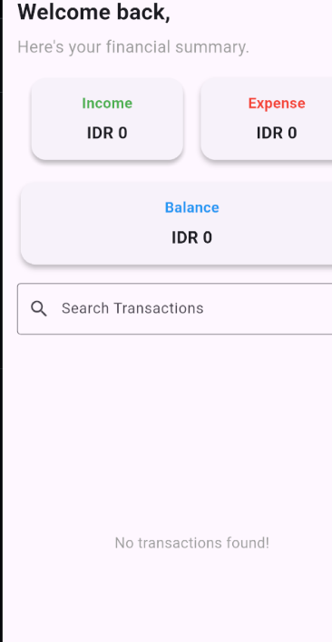
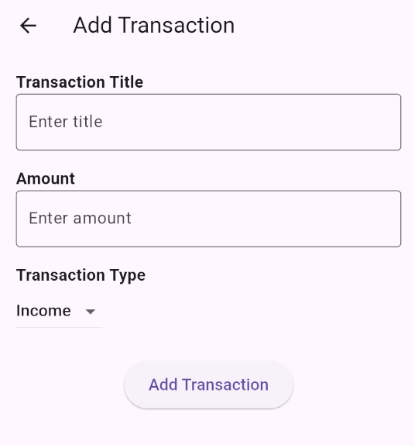

=======
# Expense Tracker

Expense Tracker adalah aplikasi manajemen keuangan yang membantu pengguna mencatat pendapatan dan pengeluaran mereka. Aplikasi ini dibangun menggunakan **Flutter** dan menyimpan data transaksi menggunakan **Shared Preferences**.

## 📌 **Fitur**
- **Menambahkan transaksi** (Income & Expense)
- **Menghitung total saldo (Balance)**
- **Menampilkan daftar transaksi** (dari terbaru ke terlama)
- **Menyimpan data transaksi secara lokal**
- **Mendukung pencarian transaksi**
- **Autentikasi login/logout** menggunakan `Shared Preferences`

## 🚀 **Instalasi & Menjalankan Aplikasi**
### **1. Clone Repository**
```bash
git clone https://github.com/V60Code/expense_tracker.git
cd expense_tracker
```
### **2. Install Dependencies**
```bash
flutter pub get
```
### **3. Jalankan Aplikasi**
```bash
flutter run
```
> **Catatan:** Pastikan perangkat emulator atau perangkat fisik sudah terkoneksi.

## 📂 **Struktur Proyek**
```
lib/
│-- main.dart              # Entry point aplikasi
│-- pages/
   │-- home_page.dart     # Halaman utama
   │-- login_page.dart    # Halaman login
   │-- profile_page.dart  # Halaman profil
   │-- splash_screen.dart # Halaman splash screen
   │-- add_transaction_page.dart # Halaman tambah transaksi
   └-- main_page.dart     # Layout dengan bottom navigation
   └-- transaction_card.dart # Widget kartu transaksi
```

## 🛠 **Teknologi yang Digunakan**
- **Flutter** (Dart)
- **Shared Preferences** (Penyimpanan lokal)
- **Intl** (Format mata uang & tanggal)
- **Material UI**

## 📷 **Tangkapan Layar**
### **🏠 Halaman Home**


### **➕ Menambah Transaksi**


### **🔍 Pencarian Transaksi**


## 📝 **Catatan Pengembangan**
- Saat login pertama kali, navbar mungkin tidak muncul. **Tutup dan buka kembali aplikasi** untuk melihat navbar muncul.
- Jika transaksi tidak muncul setelah ditambahkan, pastikan penyimpanan data berhasil dengan `Shared Preferences`.
- **Pastikan koneksi ke perangkat/emulator stabil** saat menjalankan aplikasi.

## 🤝 **Kontribusi**
1. Fork repository ini 🍴
2. Buat branch baru (`git checkout -b fitur-baru`)
3. Commit perubahan (`git commit -m 'Menambahkan fitur X'`)
4. Push ke branch (`git push origin fitur-baru`)
5. Buat **Pull Request** 🎉

## 📌 **Lisensi**
Proyek ini dirilis di bawah **MIT License**.

---
💡 **Dibuat dengan ❤️ oleh [V60Code](https://github.com/V60Code)**
